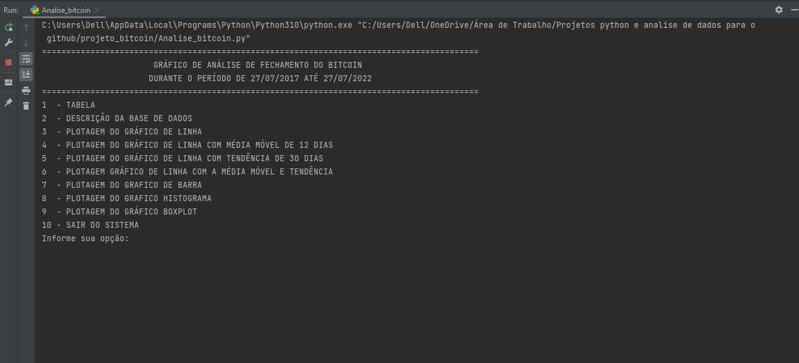
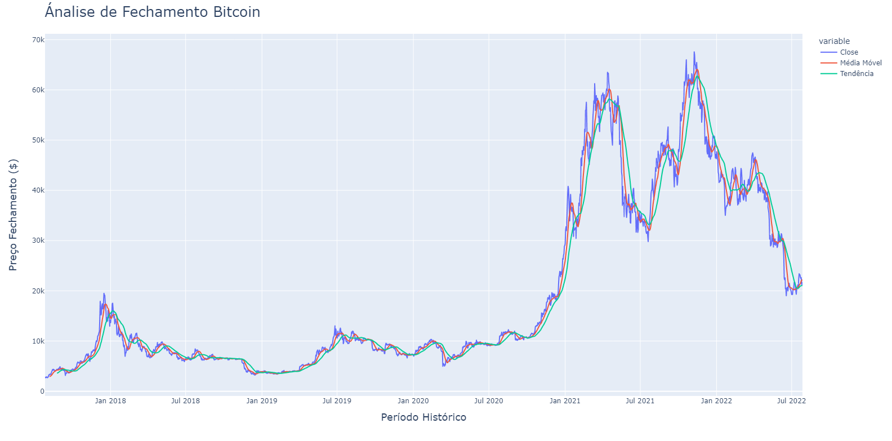

# Data-science-projects-with-python
Data analysis and visualization projects using the python language. Some libraries were used such as: Pandas, Numpy, StartsModels, Matplotlib, Seaborn and others.

### Projeto Bitcoin

#### Índice

* [Descrição do projeto](#descrio-do-projeto)
* [Status do Projeto](#status-do-projeto)
* [Funcionalidade e demonstração da aplicação](#funcionalidade-e-demonstrao-da-aplicao)
* [Tecnologia utilizadas](#tecnologias-utilizadas)
* [Melhorias Futuras](#melhorias-futuras)
* [Desenvolvedor do projeto](#desenvolvedor-do-projeto)

### Descrição do projeto
Nesse projeto foi realizado uma análise do preço de fechamento do bitcoin em um periogo de 5 anos. 
Foi criada uma classe chamada Basedados com metodos get para podemos retorna os dados da base de dados. 
Foi utilizado as bibliotecas pandas, timer e plotly.express para realização de análise, visualização 
dos dados e visualizações do gráficos. 
No projeto teremos um menu onde podemos acessar o que desejamos visualizar. Nesse menu contém: a base
de dados, uma descrição da base de dados, graficos de linha contendo os dados de fechamento, média móvel
de 12 dias e tendência de 30 dias, uma gráfico de barra onde podemos visualizar os meses que o bitcoin
fechou negativamento e positivamente, um histograma onde podemos verificar a quantidade de vezes que o
bitcoin chegou em um determinado preço e um gráfico boxplot para analisar como bitcoin e um ativo muito
volátil.

[Base de dados](https://br.financas.yahoo.com/quote/BTC-USD/history?period1=1501113600&period2=1658880000&interval=1d&filter=history&frequency=1d&includeAdjustedClose=true "Histórico de preços bitcoin")

### Status do projeto

### Funcionalidade e demonstração da aplicação

##### Menu inicial 

##### Gráfico de linha

##### Gráfico Boxplot

### Tecnologias utilizadas 
* [Python 3.10](https://www.python.org/downloads/) - Linguagem utilizada para criação do projeto.
* [Pandas](https://pandas.pydata.org/) - Biblioteca utilizada para manipulação dos dados
* [Plotly Express](https://plotly.com/python/plotly-express/) - Biblioteca utilizada para visualização dos gráficos

### Melhorias Futuras
- [ ] Automatização do sistema e atualização do gráfico em tempo real; 
- [ ] Melhorias na função menu; 

### Desenvolvedor do projeto
[ Vitor Souza ](https://github.com/vitorhssouza)

 
 

    